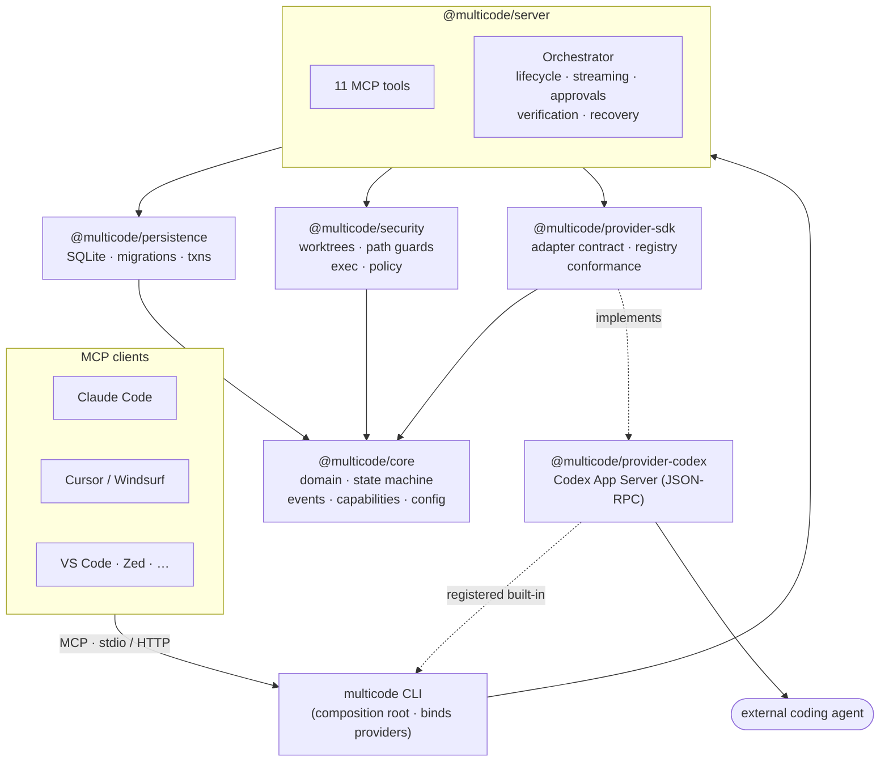
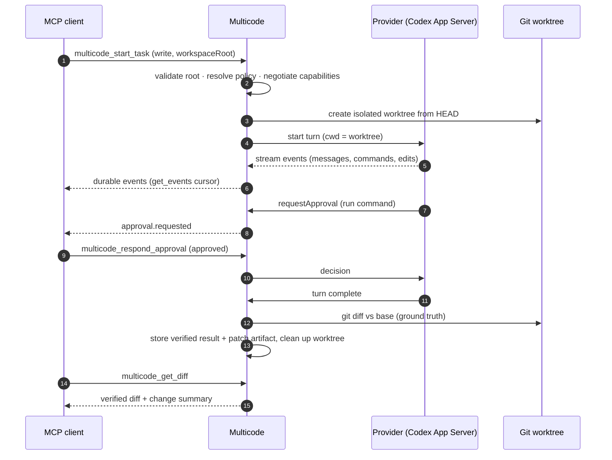

<div align="center">

# Multicode

**A model-agnostic MCP server for delegating software-engineering tasks to external coding agents.**

[](https://github.com/multicode/multicode/actions/workflows/ci.yml)
[](./LICENSE)
[](https://nodejs.org)

</div>

Multicode lets any [Model Context Protocol](https://modelcontextprotocol.io) client — Claude Code, Cursor,
IDE agents, or your own orchestrator — hand a coding task to an external agent (starting with
[OpenAI Codex](https://developers.openai.com/codex/), integrated through its official **App Server**),
then start, monitor, steer, review, and collect verified diffs from that work.

It is a **secure, local-first modular monolith**: durable SQLite persistence, isolated Git worktrees,
strict workspace-root and path-traversal guards, approval policies, and verification grounded in real
`git diff` output and command exit codes — never in an agent's own summary of what it did.

```bash
npx -y multicode-mcp init         # one-time setup + provider login
npx -y multicode-mcp serve        # run the MCP server over stdio (default)
```

→ **Adding Multicode to Claude Code, Claude Desktop, Cursor, Windsurf, VS Code, Zed, Cline, Continue,
or Gemini CLI:** see the **[Setup Guide](./docs/setup.md)**.

---

## Why Multicode

| | |
|---|---|
| **Model-agnostic** | The domain, task lifecycle, tools, persistence, and event model are provider-neutral. Providers are adapter packages behind a stable SDK. Codex is first; more can be added without touching the core. |
| **Durable** | Tasks survive client disconnects, provider crashes, and Multicode restarts. State transitions are transactional; recovery is deterministic. |
| **Isolated** | Write-capable tasks run in dedicated Git worktrees with workspace-root validation, path-traversal protection, sandbox + network controls, timeouts, bounded output, and safe cleanup. |
| **Verifiable** | Results are checked against actual Git diffs, commands, exit codes, tests, and artifacts. |
| **Safe auth** | Each provider reuses its own supported local login flow. Multicode never copies, exposes, or persists subscription tokens. |
| **Extensible** | Persistence, transports, providers, and execution runtimes sit behind interfaces so PostgreSQL, remote execution, HTTP transport, and new providers slot in later without a redesign. |

## How it works

The core, persistence, security, and server layers never import a provider — concrete providers (Codex
first) are bound only at the CLI composition root and negotiated purely on declared **capabilities**.



A client calls `multicode_start_task`; Multicode validates the workspace, negotiates the provider's
capabilities, runs the turn in an isolated Git worktree, streams durable events, routes any approvals
back to the client, and returns a diff **verified against real Git output** — never the agent's own
summary:



The task itself moves through an explicit, transactional [state
machine](./docs/architecture.md#the-task-lifecycle) so it survives client disconnects, provider
crashes, and Multicode restarts with deterministic recovery.

## Packages

Multicode is a pnpm + TypeScript monorepo. The core never imports a provider.

| Package | Responsibility |
|---|---|
| [`@multicode/core`](./packages/core) | Provider-neutral domain: task model, state machine, event model, errors, config, capabilities. |
| [`@multicode/persistence`](./packages/persistence) | Durable store interface + SQLite implementation, migrations, transactional transitions, recovery. |
| [`@multicode/security`](./packages/security) | Workspace-root validation, path-traversal guards, Git worktree lifecycle, sandbox/network policy, output bounding. |
| [`@multicode/provider-sdk`](./packages/provider-sdk) | The stable provider adapter contract, capability negotiation, and the shared conformance suite third-party providers must pass. |
| [`@multicode/server`](./packages/server) | The MCP server: tool definitions, the task orchestrator, event streaming, approval routing, recovery on boot. |
| [`@multicode/provider-codex`](./packages/providers/codex) | The Codex adapter (official App Server protocol — not terminal scraping or `codex exec`). |
| [`@multicode/cli`](./packages/cli) | The `multicode` binary: setup, diagnostics, provider management, task inspection, approvals, config validation, and `serve`. |

See [`docs/architecture.md`](./docs/architecture.md) and the [ADRs](./docs/adr) for the reasoning.

## MCP tools

Multicode exposes a provider-neutral tool surface. Availability of individual capabilities (steering,
resume, approvals, …) is negotiated per provider, not hardcoded.

| Tool | Purpose |
|---|---|
| `multicode_list_providers` | Discover configured providers and their negotiated capabilities. |
| `multicode_start_task` | Start a coding task for a provider in a workspace (read-only or write, worktree-isolated). |
| `multicode_get_task` | Fetch a task's current status, metadata, and structured result. |
| `multicode_list_tasks` | List and filter tasks. |
| `multicode_get_events` | Page through a task's durable event log (streamed provider output, approvals, transitions). |
| `multicode_continue_task` | Send a follow-up message to a resumable task/session. |
| `multicode_steer_task` | Inject mid-flight guidance without restarting. |
| `multicode_respond_approval` | Approve or deny a pending provider approval request. |
| `multicode_cancel_task` | Cooperatively cancel, then hard-stop after a grace period. |
| `multicode_get_diff` | Return the verified `git diff` and change summary for a write task's worktree. |
| `multicode_get_artifacts` | List/fetch artifacts a task produced. |

Tool schemas are defined with [Zod](https://zod.dev) and validated on every call.

## Install & setup

Requirements: **Node ≥ 20.10**, **git**, and the provider CLI you intend to use (e.g. the Codex CLI).

**One-time setup:**

```bash
npx -y multicode-mcp init                 # create ~/.multicode + a starter config
npx -y multicode-mcp provider login codex # reuse Codex's own login — no token touches Multicode
npx -y multicode-mcp doctor               # verify Node, git, providers, and workspace roots
```

**Register with your client.** The fastest is Claude Code:

```bash
claude mcp add --scope user multicode -- npx -y multicode-mcp serve
```

Most other clients take a small config block. Note the wrapper differs — **VS Code uses `servers`**,
**Zed uses `context_servers`**, everyone else uses `mcpServers`:

```json
{
  "mcpServers": {
    "multicode": { "command": "npx", "args": ["-y", "multicode-mcp", "serve"] }
  }
}
```

| Client | Add it via | Client | Add it via |
|---|---|---|---|
| **Claude Code** | `claude mcp add` | **Zed** | `context_servers` in `settings.json` |
| **Claude Desktop** | `claude_desktop_config.json` | **Cline** | `cline_mcp_settings.json` |
| **Cursor** | `~/.cursor/mcp.json` | **Continue** | `.continue/…/*.yaml` |
| **Windsurf** | `~/.codeium/windsurf/mcp_config.json` | **Gemini CLI** | `gemini mcp add` |
| **VS Code (Copilot)** | `.vscode/mcp.json` (`servers` key) | **any other** | `mcpServers` block |

📖 The **[Setup Guide](./docs/setup.md)** has the exact config, file paths, and per-client caveats
(agent mode, Windows `npx`, restart), plus **remote/HTTP transport**, troubleshooting, and uninstall.
See [`examples/`](./examples) for Claude Code and generic-MCP-client walkthroughs.

### Build from source (contributors)

```bash
git clone https://github.com/multicode/multicode && cd multicode
corepack enable && pnpm install && pnpm build
node packages/cli/dist/bin/multicode.js doctor
```

## Security

Multicode is built to run untrusted agent output safely. Highlights:

- **Workspace-root confinement** — every path a task touches is resolved and asserted to live inside an
  approved workspace root; symlink and `..` traversal are rejected.
- **Worktree isolation** — write tasks operate in a throwaway `git worktree`, never your working copy.
- **Approval policies** — provider requests for elevated actions surface as MCP approvals; nothing
  escalates silently.
- **No token exfiltration** — provider credentials stay in the provider's own store; Multicode reads
  auth *status*, never the secret.

Read [`docs/security.md`](./docs/security.md) before deploying. Report vulnerabilities per
[`SECURITY.md`](./SECURITY.md).

## Development

```bash
pnpm install
pnpm build          # tsc -b across the workspace
pnpm test           # vitest: unit, integration, contract, and property-based tests
pnpm lint           # eslint
pnpm typecheck      # strict tsc across project references
```

Contributions welcome — see [`CONTRIBUTING.md`](./CONTRIBUTING.md). Releases follow
[semantic versioning](https://semver.org); see [`CHANGELOG.md`](./CHANGELOG.md).

## License

[Apache-2.0](./LICENSE) © The Multicode Authors.
